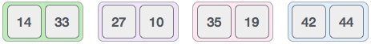
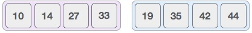

Merge sort is a sorting technique based on divide and conquer technique. With worst-case time complexity being Ο(n log n), it is one of the most respected algorithms.

Merge sort first divides the array into equal halves and then combines them in a sorted manner.

### How Merge Sort work?

To understand merge sort, we take an unsorted array as the following −


We know that merge sort first divides the whole array iteratively into equal halves unless the atomic values are achieved. We see here that an array of 8 items is divided into two arrays of size 4.


This does not change the sequence of appearance of items in the original. Now we divide these two arrays into halves.



We further divide these arrays and we achieve atomic value which can no more be divided.


Now, we combine them in exactly the same manner as they were broken down. Please note the color codes given to these lists.

We first compare the element for each list and then combine them into another list in a sorted manner. We see that 14 and 33 are in sorted positions. We compare 27 and 10 and in the target list of 2 values we put 10 first, followed by 27. We change the order of 19 and 35 whereas 42 and 44 are placed sequentially.


In the next iteration of the combining phase, we compare lists of two data values, and merge them into a list of found data values placing all in a sorted order.



After the final merging, the list should look like this −


Now we should learn some programming aspects of merge sorting.

### Pseudocode

We shall now see the pseudocodes for merge sort functions. As our algorithms point out two main functions − divide & merge.

Merge sort works with recursion and we shall see our implementation in the same way.

```javascript
procedure mergeSort(var a as array)
	if (n == 1) return a
	
	var l1 as array = a[0] ... a[n/2]
	var l2 as array = a[n/2 + 1] ... a[n]

	l1 = mergeSort(11)
	l2 = mergeSort(12)

	return merge(l1, l2)
end procedure

procedure merge(var a as array, var b as array)
	var c as array
  while (a and b has elements)
    if(a[0] > b[0])
      add b[0] to the end of c
      remove b[0] from b
    else
      add a[0] to the end of c
      remove a[0] from a
    end if
  end while
  
  while (a has element)
    add a[0] to the end of a
    remove a[0] from a
  end while
  
  while (b has element)
    add b[0] to the end of b
    remove b[0] from b
  end while
  
  return c
end procedure
```

