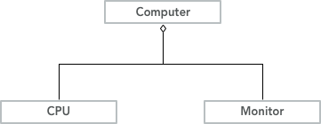

# 类图、对象图和包图

使用面向对象的思想描述系统，能够把复杂的系统简单化、直观化，有利于用面向对象的程序设计语言实现系统，有利于未来对系统的维护。构成面向对象模型的元素有类、对象和类与类之间的关系等。类图和对象图合称为结构模型视图或者静态视图。为了控制系统的复杂性，通常将系统分为更小的单元，UML提供了包机制来提供建模支持。

## 类图

在面向对象的处理中，类图处于核心地位。类图是正向工程（将模型转化为代码）的主要资源，是逆向工程（将代码转化为模型）的生成物。

### 概述

类图是描述类、接口以及它们之间关系的图。其他许多图，如状态图、协作图、组件图和配置图等都是在类图的基础上进一步描述系统其他方面的特性。

类图可以包含类、接口、依赖关系、泛化关系、关联关系和实现关系等模型元素，也可以包含注释、约束、包或子系统。

类图用于对系统的静态视图（它用于描述系统的功能需求）建模，通常用如下的几种方式使用类图：

+ **对系统的词汇建模**	在对系统建模时，通常首先构造系统的基本词汇，以描述系统的边界。在对词汇进行建模时，通常需要判断哪些抽象是系统的一部分，哪些位于系统的边界之外。
+ **对协作建模** 协作是一些协同工作的类、接口和其他元素的共同体，其中元素协作时的功能强于它们单独工作时的功能之和。
+ **对数据库模式建模** 可以使用类图对数据库模式进行建模

### 类及类的表示

UML采用分栏表示类，分别包含名称、属性、操作。

+ 名称。类名可分为简单名称和路径名称。

+ 属性。描述类属性的语法格式如下：[可见性]属性名\[:类型]\[=初始值]\[{属性字符串}]
+ 操作。描述类操作的语法格式如下：[可见性]操作名\[(参数表)]\[:返回类型]\[{属性字符串}]

+ 职责。可以在类标记中操作分栏的下面另外添加一个分栏，用于说明类的职责。
+ 约束。在类的标记中说明类的职责是消除二义性的一种非形式化的方法，而使用余数则是一种形式化的方法。约束指定了类应该满足的一个或者多个规则。约束在UML中用花括号括起来的文本表示。除此之外可以在类图中使用注释。

### 定义类

回答一下问题可以有助于定义类：

+ 有没有必须处理和存储的数据，如果有，这些数据就需要抽象为类。
+ 有没有外部系统，如果有，可以将外部系统抽象为类。
+ 有没有模版、类库、组件，如果有，这些可以作为类。
+ 系统中有什么角色，这些角色可以抽象为类。
+ 系统中有没有被控制的设备，如果有，那么系统中应该有与这些设备对应的类。

## 关联关系

类图中的关联关系定义了对象之间的关系准则，在应用程序创建和使用关系时，关联提供了维护关系完整性的准则。

关联意味着类实际上以属性的形式包含对其他类的一个或多个对象的引用。

### 二元关联

两个类参与的关联即二元关联。

一个完整的关联包含了三部分定义：表示类关联关系的直线和两个关联端点。其中，直线以及关联名称定义了该关系的标志和目的，关联端点定义了参与关联的对象所应遵循的规则。在UML规范中，关联端点是一个元类，它拥有自己的属性，例如，多重性、约束、角色等。

+  关联的名称。
+ 关联的端点。每个关联端点都包含了如下内容：端点上的对象在关联关系中扮演的角色，有多少关联可以参与关联，对象之间是否按一定的顺序排列，以及一个端点的对象是否可以访问另一端点的对象等。关联端点可以包含诸如角色、多重性、定序、约束、限定符、道航行、可变性等特征中的全部或部分。
+ 关联中的角色。任何关联关系都涉及到角色，也就是与关联相连的类的对象所办扮演的角色。
+ 多重性。多重性指有多少对象可以参与关联。多重性可以表达一个取值范围、特定值、无限定的范围或者一组离散值。
+ 定序。定序就是将一组对象按一定的顺序排列。布尔值ordered用于说明是否对对象进行排序。
+ 约束。UML定义了三种扩展机制，即标记值、原型和约束。约束条件的作用对象是靠近它的关联端点的类。约束使用的语言是OCL，不熟悉OCL的情况下可以使用自然语言。
+ 限定符。当需要使用某些信息作为关键字来识别对象集合中的一个对象时，可以使用限定符。
+ 导航性。导航性描述一个对象通过链进行导航访问另一个对象，也就是说，对一个关联端点设置道航行意味着本端的对象可以被另一端的对象访问。
+ 可变性。可变性允许建模着对属于某个关联的链进行操作，默认情况下时允许任何形式的编辑，例如，添加、删除等。在预定义的可变性选项中，{frozen}表示链一旦被建立，就不能移动或者改变，如果应用程序只允许创建新链而不允许删除链，则可以使用{addOnly}选项。

### 关联类

关联类就是与一个关联关系相连的类，用关联类表示该关联的附加消息。使用关联类可以增加模型的灵活性，并能够增强系统的易维护性，因此，在模型尽量使用关联类。

### 或关联与反身关联

当两个关联不能同时发生时，用一条虚线连接这两个关联，并且虚线的中间带有{OR}关键字。

有时候，参与关联的对象同属于一个类，这种关联被称为反身关联。

### 聚合

聚合关系是在关联关系上的进一步紧密耦合，用来表明一个类是整体，它由一个或多个部分类组成。表示聚合关系时，要在关联实线的连接整体类那一端添加菱形。

### 组成

在类的众多关系中，再加强一步的耦合是组合关系。它和聚合关系的异同之处在于组成的关联中，整体类同样由部分组成，但是部分类需要整体类才能存在。组成关系可以嵌套。

## 泛化关系

泛化关系描述了一般事物和特殊事物之间的关联。

### 泛化的含义和用途

泛化关系是一种存在于一般元素和特殊元素之间的分类关系。泛化关系只应用在类型上，而不应用与具体的实例。泛化主要有两个用途，第一个用途是当变量被声明承载某个类时，可使用类的实例作为值。第二个用途是泛化使得多态成为可能性。

### 泛化的层次与多重继承

多重继承在UML的术语中被称为多重泛化。多重继承的父类会存在诸多问题，因此，在面向对象系统开发中被禁示。Java和C#都不支持多重继承。

### 泛化约束

有两种模式为泛化建模约束。如果有多个泛化使用相同的约束，可以绘制虚线穿过两个泛化，并且在花括号（{}）中标注约束名。如果只有一个泛化，或多个泛化共享关联的空箭头部分，只需在朝向空箭头的花括号中建模约束。

此处介绍4中约束关系：不完全约束、完全约束、解体约束和重叠约束。

## 依赖关系和实现关系

在UML规范中，定义了4中依赖类型，分别是使用（Usage）依赖、抽象（Abstraction）依赖、绑定（Bilding）依赖和授权（Permission）依赖。

+ 使用依赖\<\<use>>用于表示一种元素使用其他元素提供的服务以实现它的行为，包括调用（call）、参数（parameter）、实例化（instantiate）、发送（send）。在建模过程中，调用依赖和参数依赖一般很少使用。
+ 抽象依赖包括跟踪、精化和派生。
+ 授权依赖用于表示一个事物访问另一个事物的能力。包括访问、导入和友元。
+ 绑定依赖用于为模版参数提供值，以提供一个新的模型元素。

## 构造类图模型

## 抽象类

为了声明操作是抽象的，应该以斜体字表示这些操作。

## 接口

接口在UML中，可以使用两种方式表示，一种是构造型，一种是球型。

## 对象图

## 包图

随着软件越来越复杂，数百个类需要有效管理。一种有效的方式是进行分组，将功能相似或相关的类组织在一起，形成若干个功能模块。

包图是维护和控制系统总体结构的重要建模工具。

包组织UML元素，包的内容可以画在包内，也可以画在包外，并以线条连接即可。

包可以嵌套。例如，Java和C#都支持嵌套包。

包里的元素具有Public或Private可见性。Public元素可以被包外访问到，而Private元素只可以被包内的元素访问。

包的导入分为公共导入\<\<import>>和私有导入\<\<access>>。

